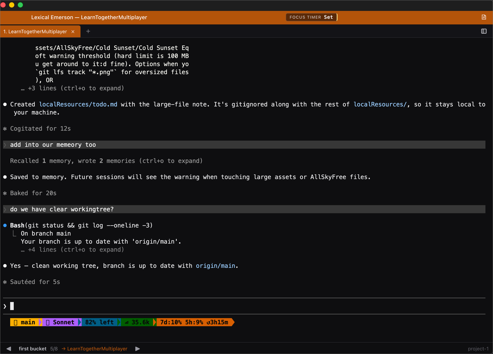

# Lexical Emerson

A lightweight macOS folder + terminal launcher for developers who use Claude Code as their primary editor.

**Not an IDE.** No Monaco, no LSP, no language servers. Just a folder, a file tree, and a real PTY-backed terminal — plus the one feature you've been missing: **cycle through a curated bucket of 3–5 active projects with one keystroke.**



## Why

VS Code costs ~500 MB of RAM per window. If you juggle 20 projects a week, that's a 10 GB ceiling before language servers even open a file. Lexical Emerson targets **~70–80 MB per window — a ~5–10× win** — by deliberately not being an editor. Your editor is `claude` running inside the terminal.

| Scenario | Lexical Emerson (target) | VS Code (typical) |
|---|---|---|
| 1 window | ≤ 100 MB | ~500 MB |
| 5 windows (typical active workload) | ≤ 400 MB | ~2.5 GB |
| 20 windows | ≤ 1.5 GB | ~10 GB+ |

## Features (v0.1)

- **File tree** per project window — lazy children, no FS watcher overhead.
- **PTY-backed terminal** with multiple tabs per window — `claude`, `vim`, `htop`, anything works exactly as in Terminal.app.
- **Multi-window** — one project per macOS window, each with its own state, file tree, and terminals. macOS's WindowServer handles Cmd-` cycling for free.
- **Smart-sorted Recent Projects** sidebar — last 20, ranked by `max(last_active_at, last_focused_at - 1h)` so the project you're actually typing in beats one you just alt-tabbed past.
- **Cmd+P switcher** — fuzzy-search across every known project. Enter opens (or focuses).
- **Buckets — the killer feature** — group your 3–5 active projects into a named bucket, then jump between their windows with one keystroke (`⌘J` forward, `⌘⇧J` back). Persists across app restarts.
- **Per-project terminal persistence** — switch projects via Recent and your old terminals stay alive in the background; switch back and the cursor and scrollback are right where you left them.

## Keyboard shortcuts

| Action | Shortcut |
|---|---|
| Quick Switcher (fuzzy project search) | `⌘P` |
| New terminal tab (in focused window) | `⌘T` |
| Close current terminal tab | `⌘W` |
| Next / previous terminal tab | `⌘⇧]` / `⌘⇧[` |
| Cycle bucket forward / backward | `⌘J` / `⌘⇧J` |
| New bucket | `⌘⇧B` |

All shortcuts are app-scoped — they fire only when Lexical Emerson is the frontmost app, and only in the focused window (so `⌘T` doesn't open a tab in every window at once).

## Install (v0.1, ad-hoc-signed)

Download `Lexical-Emerson-0.1.0.app.zip` from the Releases page, unzip, drag `Lexical Emerson.app` to `/Applications`.

**First launch:** macOS Gatekeeper will block the app because v0.1 isn't notarized. Right-click the app icon → **Open** → confirm. After this, it launches normally.

(Notarization is on the roadmap; for now it's a personal-use tool and the Gatekeeper bypass is a one-time tap.)

## Build from source

Requires Node ≥ 20, Rust ≥ 1.80, and the Tauri CLI prereqs (Xcode CLT on macOS).

```bash
npm install
npm run tauri dev          # dev with HMR
npm run tauri build        # release .app at src-tauri/target/release/bundle/macos/
```

## Tech

- [Tauri v2](https://v2.tauri.app) + Rust backend
- [Solid.js](https://solidjs.com) + TypeScript frontend (no React)
- [xterm.js](https://xtermjs.org) terminal renderer with WebGL addon
- [`portable-pty`](https://docs.rs/portable-pty) Rust PTY crate
- [rusqlite](https://docs.rs/rusqlite) state store, WAL mode

See [`docs/ADRs/`](docs/ADRs/) for why each was chosen.

## Roadmap

| | Status | What's in it |
|---|---|---|
| **v0.1** | shipping | All features above, ad-hoc-signed |
| v0.1.1 | next | Apple notarization + DMG + GitHub Releases pipeline |
| v0.2 | planned | Linux + Windows builds, per-project shell override, "last modified" as a smart-sort signal, dotfile visibility toggle (`Cmd+.`) |

## License

[MIT](LICENSE)
